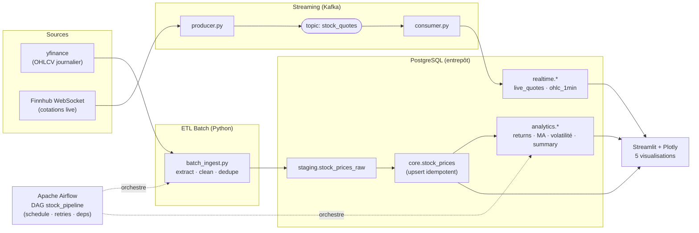

# Architecture — Pipeline d'analyse boursière en temps réel

Flux de données de bout en bout : **source → ETL batch → couche SQL (ELT) → streaming → orchestration → dashboard**.

## Couches (architecture en médaillon)

| Schéma      | Rôle                                              | Alimenté par            |
|-------------|---------------------------------------------------|-------------------------|
| `staging`   | données brutes telles qu'ingérées                 | ETL batch               |
| `core`      | source de vérité conformée + dédupliquée          | ETL batch (upsert)      |
| `analytics` | reporting SQL (rendements, MA, volatilité, summary) | transformations ELT     |
| `realtime`  | sink du flux temps réel                           | consumer Kafka          |

## Composants (mapping cahier des charges)

1. **ETL Batch** — `etl/batch_ingest.py` : yfinance → nettoyage → `staging` → upsert idempotent `core`.
2. **ELT SQL** — `sql/02_transforms.sql` : vues + table de reporting sur `core`.
3. **Streaming** — `streaming/producer.py` (Finnhub → Kafka) + `streaming/consumer.py` (Kafka → `realtime`).
4. **Orchestration** — `dags/stock_pipeline_dag.py` : DAG Airflow planifié, avec retries et dépendances.
5. **Dashboard** — `dashboard/app.py` : Streamlit, 5 visualisations rafraîchies.

> Pour exporter en image : ouvrir ce fichier sur GitHub (rendu Mermaid natif), ou coller le bloc
> `mermaid` dans <https://mermaid.live> puis exporter en PNG/SVG pour la soumission / les slides.
